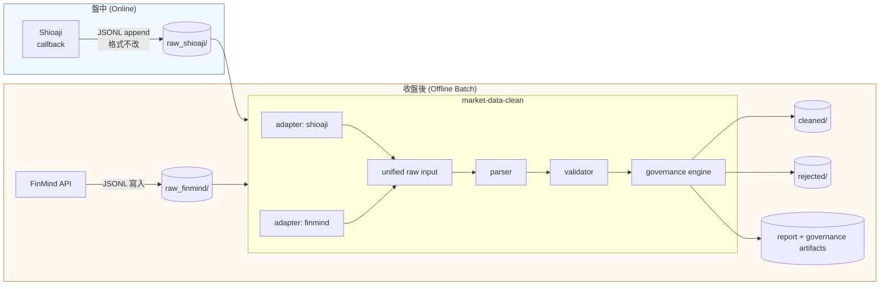

# market-data-clean

A **data-governance-first** cleaning layer for **Taiwan financial market data**, purpose-built for downstream research and backtesting.

## Goal

Produce a **normalized, validated, auditable, and governance-rich** dataset from raw market data — combining data quality management, lineage tracking, ownership metadata, and retention policies — so that downstream research and backtesting pipelines can trust every row.

This project practices **pragmatic data governance** aligned with the [DAMA DMBoK](https://www.dama.org/cp/display-the-dama-guide-to-the-data-management-body-of-knowledge-dmbok) framework, including ownership & stewardship (DMBoK-7), metadata management & lineage (DMBoK-9), data quality management (DMBoK-10), and data lifecycle / retention (DMBoK-3).

> ⚠️ **Short-term scope: 台灣期貨（TAIFEX Futures）**  
> 目前僅支援**台股期貨** — 加權指數期貨（**TX** / 大台）、小型臺指期貨（**MTX** / 小台）。  
> 商品代碼如 `TXFR1`（近月）、`TXFR2`（遠月）、`TXFF6`（實際交割代碼）等。  
> 資料來源：Sinopac（永豐金 Shioaji，即時報價）與 FinMind（歷史日/分K/快照）。
>
> **Roadmap：後續不排除擴充至個股、加密貨幣、或其他海外市場（如美股）。**

## Scope

- **Ingest** raw files from Taiwan market data sources
- **Normalize** schema and timestamps into a canonical format
- **Validate** rows against defined business rules
- **Govern** every row with lineage, quality scores, and source provenance
- **Split** accepted / rejected records with rejection reasons
- **Report** a cleaning report enriched with governance metadata (ownership map, retention advisory, quality summary)

## Data Governance Practices

| Practice                          | DMBoK Area | How This Repo Implements It                                                                                                      |
| --------------------------------- | ---------- | -------------------------------------------------------------------------------------------------------------------------------- |
| **Ownership & Stewardship**       | DMBoK-7    | `governance.yaml` defines data stewards, owners, criticality per symbol/source                                                   |
| **Data Quality Management**       | DMBoK-10   | Validator checks business rules; `quality.json` captures per-rule histograms, null counts, outlier flags                         |
| **Metadata Management & Lineage** | DMBoK-9    | Every run produces a manifest (`run_id`, git hash, adapter versions); every row carries `governance.run_id` and `source_version` |
| **Data Lifecycle & Retention**    | DMBoK-3    | Configurable retention policies per output category with advisory scans                                                          |
| **Audit Trail**                   | DMBoK-9    | Append-only `audit_log.jsonl` records every cleaning run                                                                         |
| **Reference Data Management**     | DMBoK-7    | Symbol-source registry in governance config with data domain classification                                                      |

## MVP

1. Define the data contract
2. Implement validation rules
3. Add governance engine (config, manifest, quality snapshot, audit log)
4. Add a simple CLI with governance subcommands
5. Write a sample cleaning pipeline

## Quick Start

```bash
# Install
pip install market-data-clean

# Run with governance (default config auto-detected)
market-data-clean --input data/raw/input.csv --output data/cleaned/

# Initialize a governance config template
market-data-clean governance init-config

# Check retention compliance
market-data-clean governance retention-check --config governance.yaml --data-dir data/
```

## Repo Layout

```
.
├── docs/               # Contracts, specs, governance documentation
│   ├── specs/          # Feature specifications
│   └── data-contract.md
├── src/                # Package code
│   └── market_data_clean/
│       ├── governance.py        # Governance engine
│       ├── governance_schema.py # Pydantic models
│       ├── validator.py         # Validation rules
│       └── cli.py               # CLI entrypoint
├── tests/              # Unit & integration tests
├── governance.yaml     # (default) Governance configuration
└── pyproject.toml
```

## Architecture & Data Flow



> **設計原則：** 盤中 callback 只做輕量落地（不轉格式、不阻斷），所有轉換、驗證、治理都在收盤後的 batch 完成。  
> **落地格式統一使用 JSON Lines（`.jsonl`）**，每筆資料一行，Shioaji callback 來就 append，FinMind fetch 後也寫成同樣格式。  
> 同一套 adapter + validator + governance engine 處理所有來源。

## Status

This repo is intentionally small at first. **The contract comes before feature growth.**  
Currently focused on Taiwan index futures (TX / MTX) with a DMBoK-aligned governance foundation.  
Future expansions to stocks, crypto, or international markets remain open.
